```{r setup, include=FALSE}
knitr::opts_chunk$set(echo = TRUE)
```

## What is it

_**While air quality in Ireland is generally good, there are concerning localised issues – these impact negatively on our environment and on our health, resulting in approximately 1,600 premature deaths per year [Air quality report 2023, EPA].**_

We often burn solid fuels like coal, peat and wood to heat our homes. This practice is the source of one of our main air pollutants of concern - Fine Particulate Matter or [PM~2.5~](#particulate-matter)

On cold still nights, we see high levels of PM~2.5~ in our villages, towns and cities. 

We know that solid fuel burning in our homes is the primary source through research projects like Source Apportionment of Particulate Matter in Urban and Rural Residential Areas of Ireland. Between 2014 to 2016 this project monitored air quality in Killarney, Enniscorthy and Birr and analysed the composition of the PM~2.5~ to see where it came from. Real-time monitoring showed that residential solid fuel burning was the dominant source category at all three locations, accounting for 72%, 82% and 60% of PM2.5 measured in Killarney, Enniscorthy and Birr, respectively.
These treemaps for each study location show the full breakdown of composition:

```{r echo=FALSE, images, fig.show = "hold", out.width = "33%", fig.align = "default"}

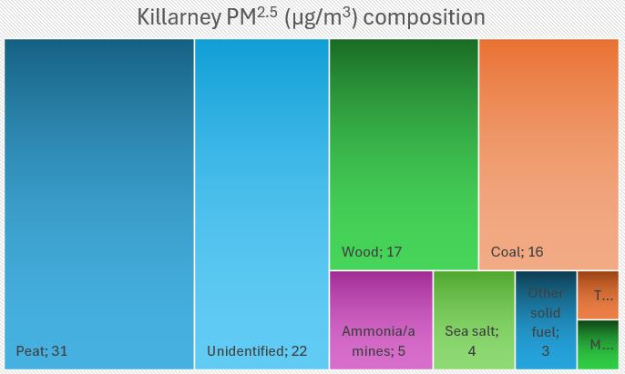

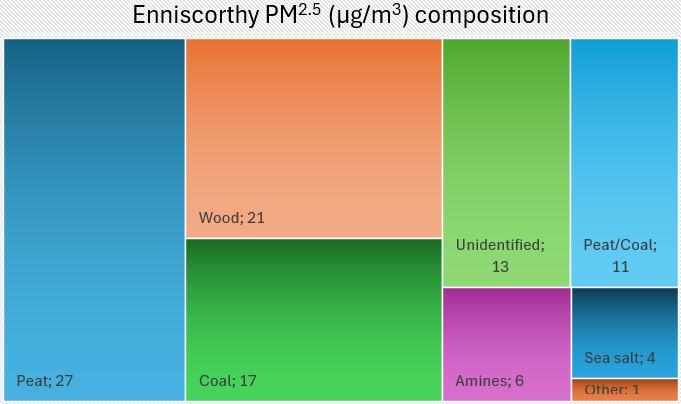

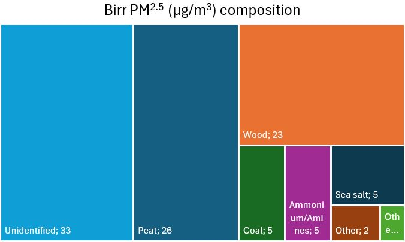


```


<center>

 

</center>


<center>

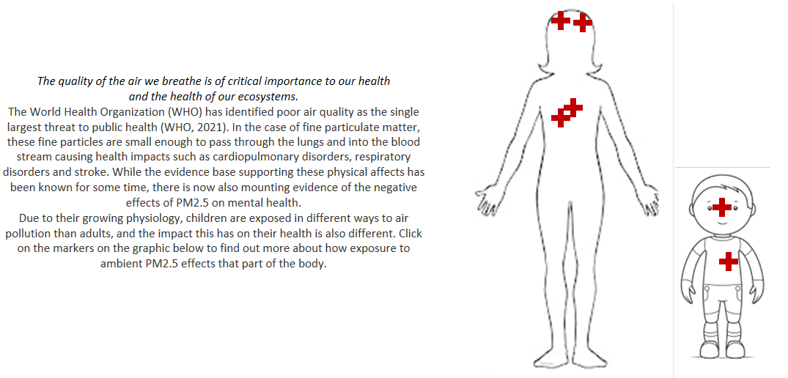 

</center>

<a id="study-table"></a>
```{r echo=FALSE}
# create data frame of health article links 
health_arts <- data.frame(
    Studies = c('[Knowledge, attitudes and perception of air pollution in Ireland](#knowledge,-attitudes-and-perceptions)', 
                '[Particulate matter and your mental health](#particulate-matter-and-your-mental-health)', 
                '[How air quality effects children](#how-air-quality-effects-children)', 
                '[How changes in air quality effect hospital admissions](#how-changes-in-air-quality-effect-hospital-admissions)'),
    stringsAsFactors = FALSE)
knitr::kable(health_arts,
caption = "User clicks on the markers on the body to popup more information for these studies … ")
```

### what drives it ... 


<center>

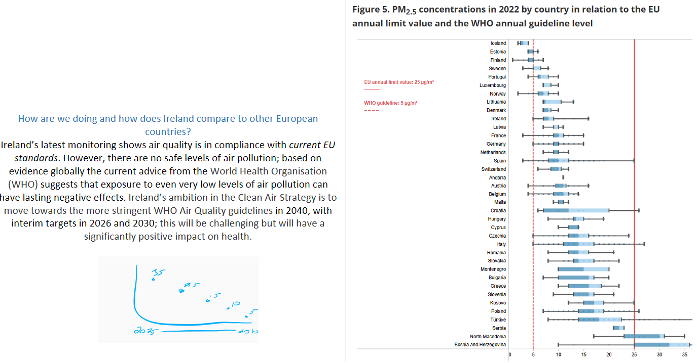 

</center>


<center>

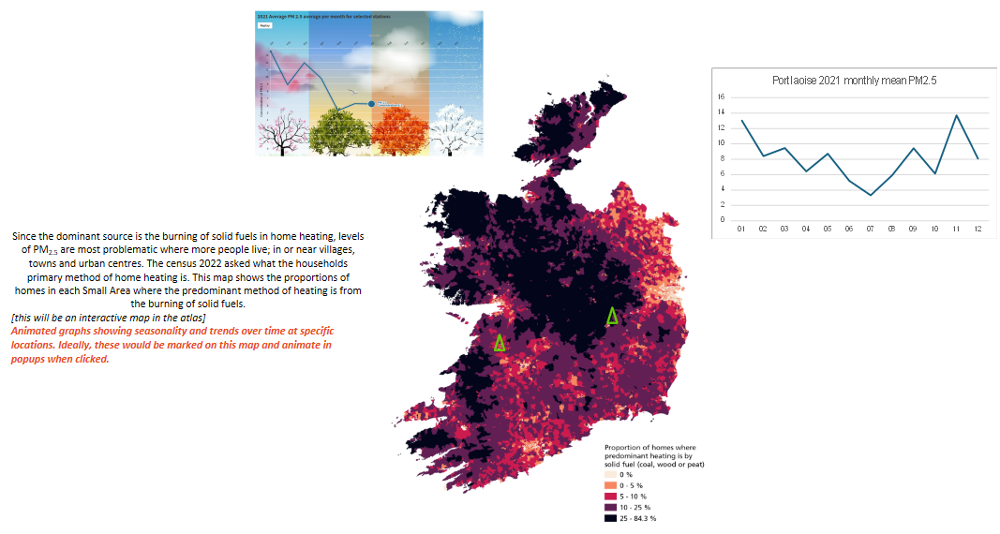 

</center>

```{=html}
<div style="display: flex; align-items: center; justify-content: space-between;">

  <div style="flex: 1; display: flex; justify-content: center; align-items: center; text-align: center; padding: 20px; word-break: normal; overflow-wrap: break-word;">
    Monitoring and observed trends in PM2.5<br>In 2017 the EPA initiated the new national Ambient Air Monitoring Programme (AAMP) with an aim to greatly expand the national monitoring network, to increase the modelling and forecasting offering to the public, and to encourage greater understanding of air quality issues and remediations for the public. Use the time slider on the map to see how and where the monitoring network has grown since then.<br>[… video outdated, just added for demonstration…]
  </div>
  <div style="flex: 1; padding: 20px;">
    <video width="100%" controls>
      <source src="EPA Air Quality report animation map 2 v5.mp4" type="video/mp4">
      Your browser does not support the video tag.
    </video>
  </div>

</div>
```

```{=html}
<div style="display: flex; align-items: center; justify-content: space-between;">

  <div style="flex: 1; display: flex; justify-content: center; align-items: center; text-align: center; padding: 20px; word-break: normal; overflow-wrap: break-word;">
    Overall, the long-term trends in ambient PM2.5 levels have been falling in 
Ireland. But over this time the evidence base has grown to support lowering the guideline values as it becomes clearer that exposure to even low concentrations causes ill-health.<br>[interactive version of this graph]
  </div>
  <div style="flex: 1; padding: 20px;">
    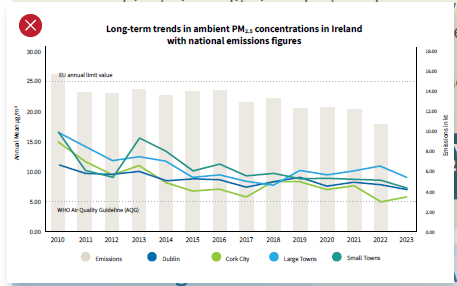
  </div>

</div>
```

```{=html}
<div style="display: flex; align-items: center; justify-content: space-between;">

  <div style="flex: 1; display: flex; justify-content: center; align-items: center; text-align: center; padding: 20px; word-break: normal; overflow-wrap: break-word;">
    The LIFE-Emerald project commenced in 2021 and ran for 3 years with the
objectives of developing models to create national 3-day air quality forecasts, near real-time mapping of air pollutants throughout the country and creating historical maps of air pollutants. The outputs from this project have now been adopted into airquality.ie where you can see hourly updated air quality index for health and forecast maps for specific pollutants for today, tomorrow and the day after. 
Annual maps are also now generated and are available for the key pollutants of PM2.5, PM10, nitrogen dioxide (NO2) and ozone (O3) from 2019 to 2023.  
Use the time slider on the map below to see how PM2.5 has changed over these years. These high resolution maps show the annual PM2.5 levels in 10m squares.<br>[will be an interactive map with a time slider allowing the user to zoom to their area if they wish and cycle through these images.]

  </div>
  <div style="flex: 1; padding: 20px;">
    <video width="100%" controls>
      <source src="annual_pm25_2019-2023.mp4" type="video/mp4">
      Your browser does not support the video tag.
    </video>
  </div>

</div>
```

```{=html}
<div style="display: flex; align-items: center; justify-content: space-between;">

  <div style="flex: 1; display: flex; justify-content: center; align-items: center; text-align: center; padding: 20px; word-break: normal; overflow-wrap: break-word;">
    Global gridded datasets of mean annual PM2.5 are available back to 1998. 
While these datasets are not as detailed they provide a greater timeseries to see the changes in ambient PM2.5 over the last almost 30 years. This animation steps through the for each year for Ireland… 
[Animation to be included if we can get the data. Gridded data at 0.01deg resolution exists but may need to be requested from DIMAQ. The downloads of US sources of the same data as geotiff seem to have disappeared from Columbia Uni project sites, but netcdf format is there and could be converted]

  </div>
  <div style="flex: 1; padding: 20px;">
    <video width="100%" controls>
      <source src="" type="video/mp4">
      Your browser does not support the video tag.
    </video>
  </div>

</div>
```

### _So we see that PM~2.5~ levels are trending downwards but meeting the WHO guide values is still a big challenge._

```{=html}
<div style="display: flex; align-items: center; justify-content: space-between;">

  <div style="flex: 1; display: flex; justify-content: center; align-items: center; text-align: center; padding: 20px; word-break: normal; overflow-wrap: break-word;">
    What we burn, impacts us, our family and our neighbours.<br><br>

Residential solid fuel burning is the dominant source of fine particulate matter - PM2.5. On still cold evenings over winter we see air pollution build up in small towns all over the country, as demonstrated in this video … 
  </div>
  
  <div style="flex: 1; padding: 20px;">
    <iframe width="100%" height="315" src="https://www.youtube.com/embed/8Cf-afWE_Es" frameborder="0"></iframe>
    <a href="https://www.youtube.com/embed/8Cf-afWE_Es">view on youtube</a>
  </div>

</div>
```


```{=html}
<div style="display: flex; align-items: center; justify-content: space-between;">

  <div style="flex: 1; display: flex; justify-content: center; align-items: center; text-align: center; padding: 20px; word-break: normal; overflow-wrap: break-word;">
    We all must comply with the solid fuel regulations. 
These are national regulations with the objective to limit pollutants generated from home heating through solid fuels and to ultimately improve air quality. 
Retailers in Ireland can only sell products that comply with these regulations. 

  </div>
  
  <div style="flex: 1; padding: 20px;">
    [INFOGRAPHIC NEEDED HERE]<br><br>
      Could cover:<br>
	- expected smoke emission rates of coal, and part-biomass products.<br>
	- The moisture content of wood bought up to 2m3<br>
	- The expectation that wood bought in quantities >2m3 needs to be dried to acceptable levels prior to use. <br>

  </div>

</div>
```


```{=html}
<div style="display: flex; align-items: center; justify-content: space-between;">

  <div style="flex: 1; display: flex; justify-content: center; align-items: center; text-align: center; padding: 20px; word-break: normal; overflow-wrap: break-word;">
    <p>If you are in a position to do so…<br><br>
    
    <b>Switch</b> - consider moving away from using solid fuels for heating and switch to a cleaner alternative.</p> 

  </div>
  <div style="flex: 1; padding: 20px;">
    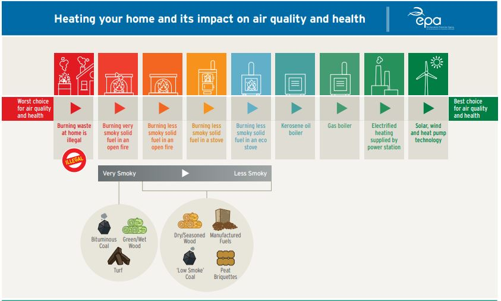
  </div>

</div>
```

```{=html}
<div style="display: flex; align-items: center; justify-content: space-between;">

  <div style="flex: 1; display: flex; justify-content: center; align-items: center; text-align: center; padding: 20px; word-break: normal; overflow-wrap: break-word;">
    <p><b>Upgrade</b> - reduce the need for heating by increasing or improving 
Insulation. Supports are available through the national retrofitting scheme.</p>
 

  </div>
  
  <div style="flex: 1; padding: 20px;">
    [NEED INFOGRAPHIC OR SIMILAR]<br><br>
      Could cover:<br>
	- RETROFITS<br>
	- One Stop Shops<br>
	- etc <br>

  </div>

</div>
```

```{=html}
<div style="display: flex; align-items: center; justify-content: space-between;">

  <div style="flex: 1; display: flex; justify-content: center; align-items: center; text-align: center; padding: 20px; word-break: normal; overflow-wrap: break-word;">
    And many people have already taken these steps; one question in the survey on Knowledge, Attitudes and perceptions of air pollution in Ireland asked what changes had respondents taken to improve the air quality of their local area. 28% of respondents said they are using less smoky fuels, and almost 25% had upgraded their homes to be more energy efficient. 

  </div>
  <div style="flex: 1; padding: 20px;">
    
  </div>

</div>
```

### _Use the resources available to keep up to date with the current and forecast air quality, especially if you are vulnerable... _

Through the Clean Air Strategy and the Solid Fuel Regulations we're implementing more 
stringent standards to help protect you and the environment. 
You should check out our monitoring, nowcasts and forecasts, especially if you have a vulnerability and intend to spend time outdoors. 
On airquality.ie you can find detailed maps on the Air Quality Index for Health for your area, and for individual pollutants like particulate matter, ozone and nitrogen dioxide. 


```{=html}
<div class="knitr-url-embed" style="margin-bottom: 1em;">
  <iframe src="https://airquality.ie/" width="100%" height="600" frameborder="0" allowfullscreen sandbox="allow-same-origin allow-scripts allow-popups allow-forms">
  </iframe>
</div>
```

```{=html}
 <br>
 <br>
 <br>
 <br>
 <br>
 <br>
 <br>
 <br>
 <br>
 <br>

```

## Particulate Matter

<center>

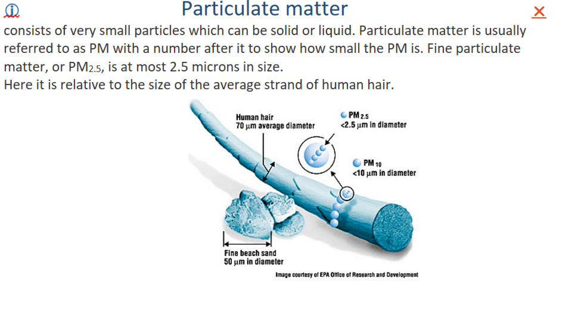 
[Back](#what-is-it)

</center>


## Knowledge, attitudes and perceptions

A recent survey of public knowledge and perceptions of air pollution in Ireland concluded that environmental health literacy around air pollution is critically lacking among respondents  [Quintyne, KAP of air pollution]. 
Therefore, this literacy gap must be addressed equally across society if behavioural change is to be achieved.

<center>

 
 
 
 
 
 
[Back](#study-table)

</center>


## Particulate matter and your mental health

While the evidence base supporting the physical affects has been known for some time, there is now also mounting evidence of the negative effects of PM~2.5~ on mental health. 

This cross-sectional analysis uses data on mental health and wellbeing from The Irish Longitudinal Study on Ageing (TILDA), a nationally representative survey of the population aged 50+ in Ireland. Annual average PM~2.5~ concentrations at respondents’ residential addresses over the period 1998–2014 are used to measure long-term exposure to ambient PM~2.5~. The study looked for a relationship between long-term (considered >6 months) exposure to ambient PM~2.5~ and mental health outcomes of depression, anxiety, stress, worry and quality of life. 

Associations were found between long-term PM~2.5~ exposure and depression and anxiety, but there was no evidence of association for stress, worry or quality of life. Many potentially related factors (e.g. age, sex, employment status, marital status, long-term health limitations, alcohol consumption problems, smoking status, polypharmacy and entitlement to free public healthcare) were accounted for and were found not to substantially affect these results. 

<center>

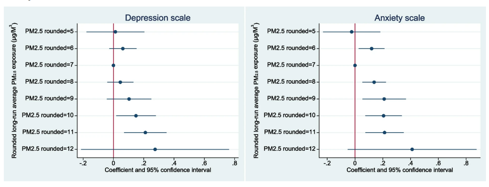 
[Back](#study-table)

</center>


## How air quality effects children

<center>

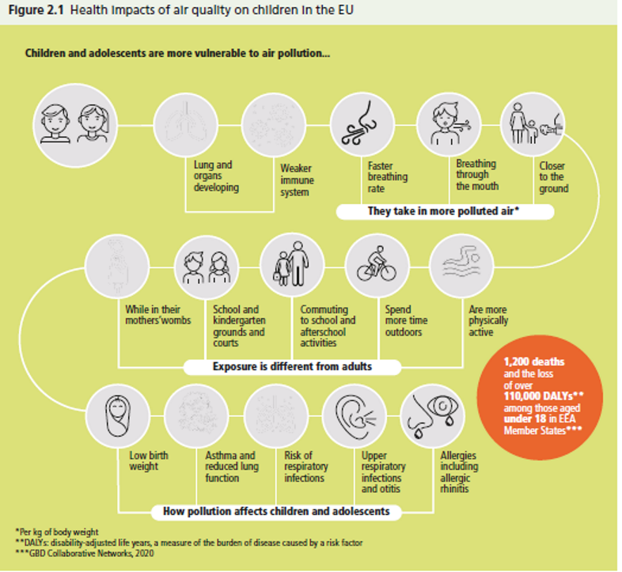 
[Back](#study-table)

</center>


## How changes in air quality effect hospital admissions

### Air Quality and its association with cardiovascular and respiratory hospital admissions in Ireland
This study by the HSE and EPA looked at daily hospital admissions for cardiovascular and respiratory diseases for patients with addresses in Dublin city and county and tried to find patterns between this and changes to the Air Quality Index for Health (AQIH). The AQIH combines different air quality measures to give a number between 1 and 10 to tell you what the air quality is in the station nearest you and whether or not this might affect the health of you or your child. 

Their main findings of this study using routinely gathered information was that there was likelihood of increased hospital admissions for asthma (up to 48 hours later), COAD (24 hours later), and heart failure (up to 24 hours later) between 2014 and 2018 with changes in short-term ambient AQIH. 
Changes in the AQIH did not seem to cause a rise in admissions for all CVS or RS diseases though; conditions such as atrial fibrillation and myocardial infarction were not affected. This might be because the AQIH combines the status of many pollutants, each of which can have different impacts on different health conditions (i.e. PM2.5 particles; PM10 particles; nitrogen dioxide gas; ozone gas; and sulphur dioxide gas). 

<center>

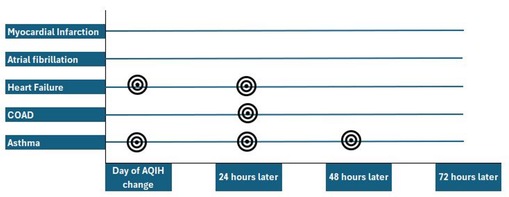 
[Back](#study-table)
</center>

